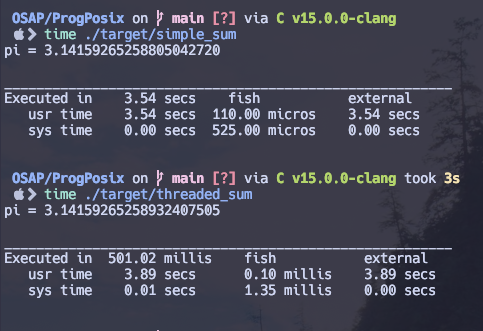

# Rendu TP 4 Linux OSAP

**Environnement de travail utilisé** :

- _OS_: MacOS Sonoma 14.3
- _Shell_: Fish 3.7.0
- _Terminal_: kitty
- _Terminal multiplexer_: tmux
- _C LSP + Formatter_: C v15.0.0-clangd

Voici les résultats obtenus en termes de délais :

