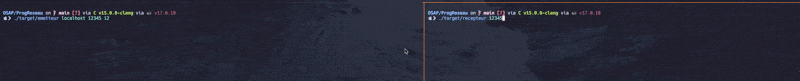

# Rendu TP 2 Linux OSAP

**Nom**: Cudennec Gaël

**Environnement de travail utilisé** :

- _OS_: MacOS Sonoma 14.3
- _Shell_: Fish 3.7.0
- _Terminal_: kitty
- _Terminal multiplexer_: tmux
- _Visualisation de processus_: htop
- _C LSP + Formatter_: C v15.0.0-clangd

## 1) Client/Serveur en TCP

Voir Code.

## 2) Serveur TCP Concurrent

Voici la ligne affichée par la commande `netstat -a -f inet` pour le client :

    Proto :  tcp4
    Recv-Q : 0
    Send-Q : 0
    Local Address : localhost.50712
    Foreign Address : localhost.9010
    (state) : ESTABLISHED

> A noter qu'on à la même chose pour le serveur :

    Proto :  tcp4
    Recv-Q : 0
    Send-Q : 0
    Local Address : localhost.9010
    Foreign Address : localhost.50712
    (state) : ESTABLISHED

> En plus d'avoir la ligne du serveur qui est en écoute :

    Proto :  tcp4
    Recv-Q : 0
    Send-Q : 0
    Local Address : localhost.9010
    Foreign Address : *.*
    (state) : LISTEN

## 3) Client Java

Voir Code java.

## 4) Serveur Web

J'ai ajouté la verification du Content-Type en fonction du fichier envoyé (seulement sur les .gif, .html et .ico).

## 5) Communication en UDP, Emetteur/Recepteur

On peut voir qu'on obtient aucune réponse dans le cas d'un message envoyé vers une addresse non existante.

## 6) Taille de tampon mémoire et taille des messages.

La ligne forçant le tampon à 80000 étant déjà présente, les fichiers à utiliser sont toujours `recepteur.c` et `emetteur.c`.

Pour l'envoi en UDP de données, la limitation est la taille maximale d'un paquet IP, qui est de 65535 octets. Cette taille inclut l'en-tête IP (20 octets pour IPv4 sans options) et l'en-tête UDP (8 octets), laissant 65507 octets disponibles pour les données dans le cas d'IPv4

## 7) Mode multicast

En raffinements, j'ai simplement ajouté la verification de l'entrée utilisateur, pour se connecter en IPv4 ou IPv6.

