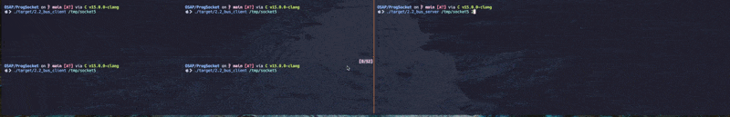

# Rendu TP 3 Linux OSAP

**Environnement de travail utilisé** :

- _OS_: MacOS Sonoma 14.3
- _Shell_: Fish 3.7.0
- _Terminal_: kitty
- _Terminal multiplexer_: tmux
- _C LSP + Formatter_: C v15.0.0-clangd

## 1) Introduction

## 2) Exercice

Voici le fonctionnement de mon bus :

### 2.1) Choix du type de socket

SOCK_SEQSTREAM n'étant pas intégré à MacOS sur mon appel système `socket()`, j'ai choisi SEQ_STREAM.
PF_UNIX etait déprécié, ainsi j'ai utilisé PF_LOCAL.
