# Rendu TP 1 Linux OSAP

**Environnement de travail utilisé** :

- _OS_: MacOS Sonoma 14.3
- _Shell_: Fish 3.7.0
- _Terminal_: kitty
- _Terminal multiplexer_: tmux
- _Visualisation de processus_: htop
- _C LSP + Formatter_: C v15.0.0-clangd

## 1) Appels systèmes et fonctions, pointeurs et structures

1_1: Voir code.

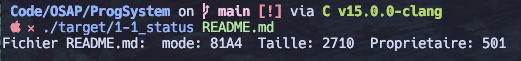

1_2: Voir code.

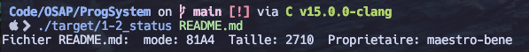

1_3: En exécutant ce code, on obtient un Job x terminated by signal SIGSEGV (Address boundary error).

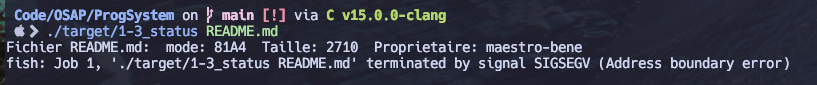

1_4: La raison est que stat() étant un appel système, nous devons lui fournir un pointeur afin qu'il sache ou écrire l'erreur, puisqu'il n'écrira jamais dans son espace mémoire pour les appels provenant de l'application.

## 2) Accès aux variables d'environnement dans un processus

2_1: Voir code.

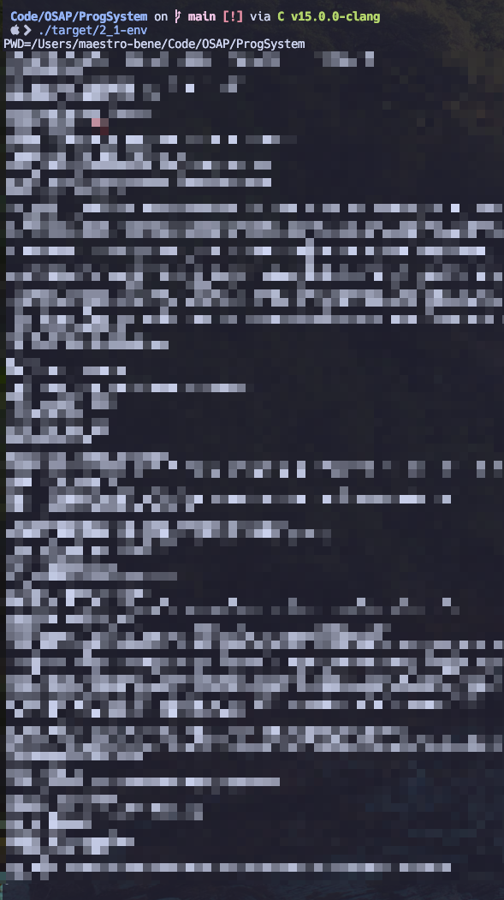

2_2: Voir code.

## 3) Utilisation de fork() et exec()

3_1:

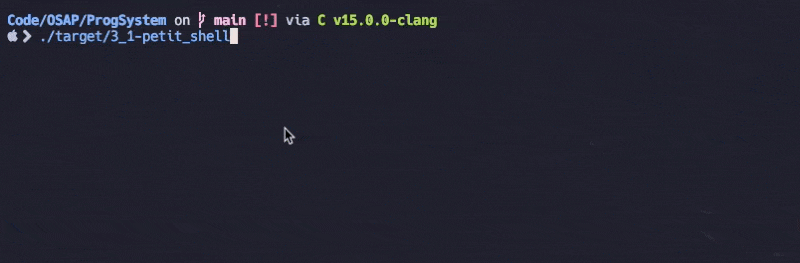

3_2:

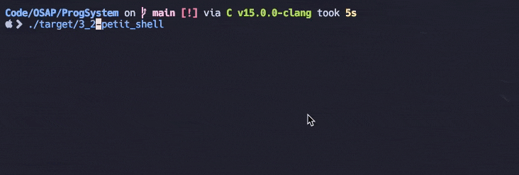

3_3: On ne quitte jamais le processus enfant, même lorsqu'il y a une erreur, donc on recrée un processus fils pour run un petit shell

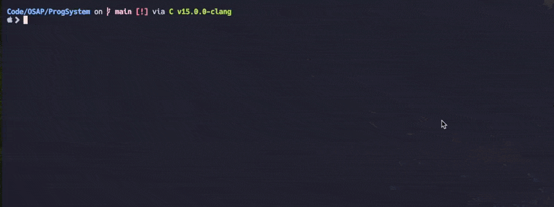

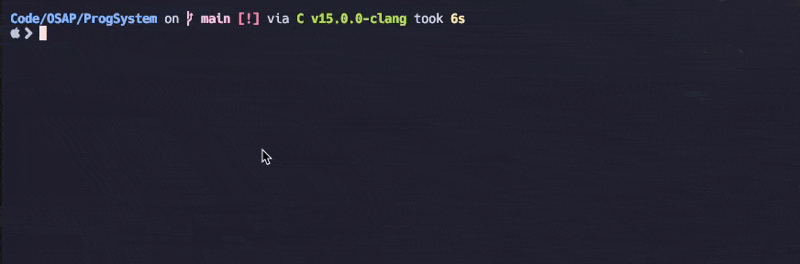

3_4: On peut maintenant ajouter des options, comme `-a` par exemple dans le cas d'un `ls`.

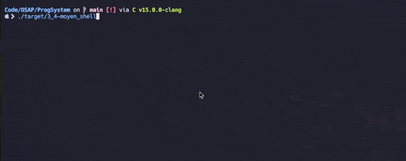

## 4) Le traitement des signaux

4_1: Etant sur MacOS, un fichier .ips a été généré HOME/Library/Logs/DiagnosticReports, avec des informations sur le process terminé: '4_1-sig-2024-03-17-134931.ips'

4_2: Mon handler est bel et bien toujours en place après avoir été utilisé une première fois.

4_3: Voir code.

4_4: Voir code.

## 5) La terminaison des processus

5_1: Voir code.

5_2: Voir code.

## 6) L'appel système fcntl()

6_1: La démonstration pour le 6_2 ci-dessous démontre que cette partie fonctionne aussi.

6_2: Ici nous voyons avec `htop` que le flag viens d'être ajouté en envoyant un SIGQUIT avec l'augmentation du CPU usage, qui passe à 100% :

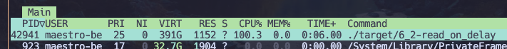

Puis nous enlevons le flag en envoyant un signal SIGINT,

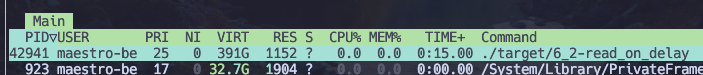

Enfin, nous voyons le résultat observable lors de ce test :

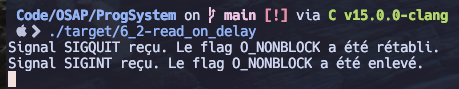

## 7) Les tubes de communication

7: Voir code, on a bien une redirection de ce que l'on écrit dans le stdin du parent. 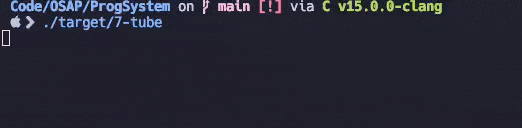

## 8) Contrôle des terminaux

8_1: On génère bien les clés comme prévu.

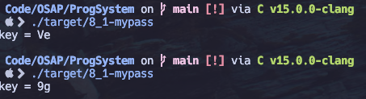

8_2: On chiffre le mot de passe que l'on rentre, sans le fait de cacher l'entrée de l'utilisateur.

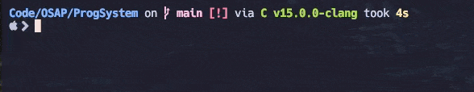

8_3: On voit bien que le mot de passe n'est plus affiché au moment de l'entrée utilisateur.

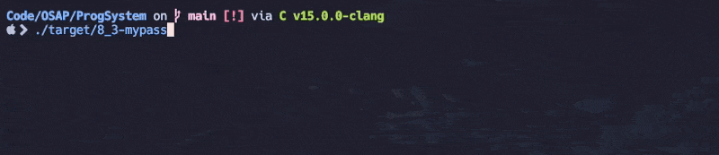

8_4: On voit bien que le mot de passe n'est toujours pas affiché, mais qu'on affiche une \* à chaque touche pressée par l'utilisateur (sauf Entrée bien sûr)

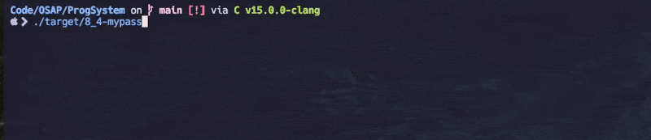
